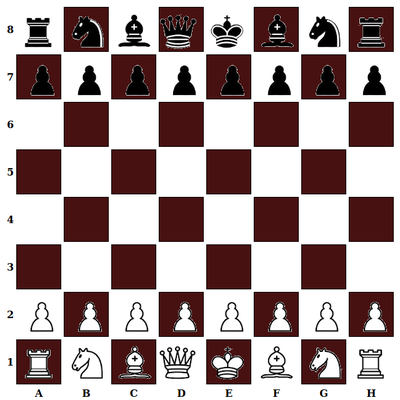
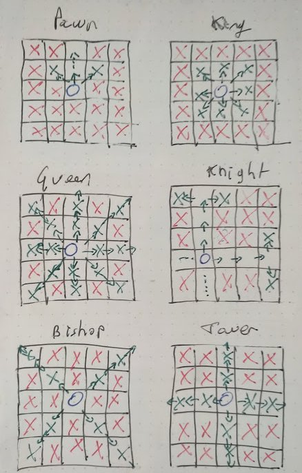

# CHESS

## 27 01 2021

Do a chess game

Stack => Javascript - css

Rules into json

***

## Steps

- [] board
- [] sprites
- [] Pieces's identification
- [] Show emable cases
- [] Move pieces
- [] Collisions

## Board

## Moves

## cases name

