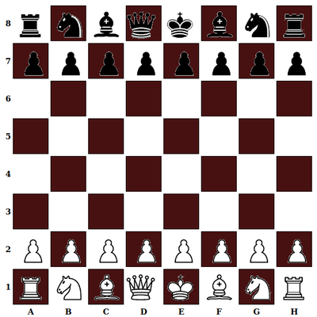
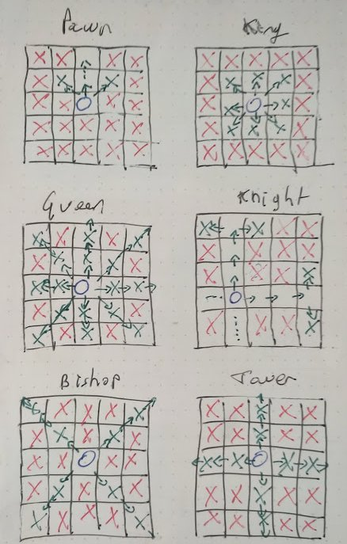

# CHESS

## 27 01 2021

Do a chess game

Stack => Javascript - css

Rules into json

***

## Board

## Moves
|:----------------------:|
|:--:| -1 |  0 | +1 |:--:|
|:--:| +1 | +1 | +1 |:--:|
|:----------------------:|
|:--:| -1 |    | +1 |:--:|
|:--:|  0 | P  |  0 |:--:|
|:----------------------:|
|:--:| -1 |  0 | +1 |:--:|
|:--:| -1 | -1 | -1 |:--:|
|:----------------------:|

|------------------------|
|----| 1  |  2 |  3 |----|
|----|    |    |    |----|
|------------------------|
|----|  4 |    |  5 |----|
|----|    | P  |    |----|
|------------------------|
|----|  6 |  7 |  8 |----|
|----|    |    |    |----|
|------------------------|

