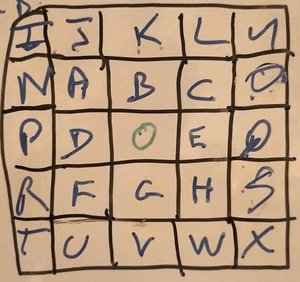

# CHESS

## 27 01 2021

Do a chess game

Stack => Javascript - css

Rules into json

***

## Steps

- [x] board
- [x] sprites
- [x] Pieces's identification
- [ ] Show enable cases
- [ ] Move pieces
- [ ] Collisions

## Board

## Moves

## cases name

